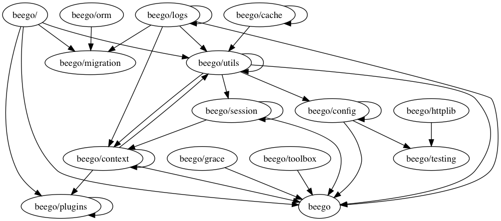

# godag
godag can help you analyse the pkg internal dependency

## 1. How to Use
### 1. Install
```bash
go get -u github.com/legendtkl/godag
```

### 2. Run
```bash
godag --pkg_name=github.com/astaxie/beego --pkg_path=/Users/kltao/code/go/src/github.com/astaxie/beego --depth=1 --dot_file_path=a.dot
```

#### Flags
* pkg_name: (***REQUIRED***) the package name you want to analyze dependency
* pkg_path: (***REQUIRED***) the package path in your computer
* depth: (***Optional***) the code depth to analyze. For example, if depth is 1, we will only analyze the pkg dag: beego/cache, beego/context; if depth is 2, we will analyze the pkgs dag: beego/cache/redis, beego/cache/ssdb etc. The default value is 1.
* dot_file_path: (***Optional***) the dot file path. The default value is godag.dot in current dir.

### 3. Visualization
You can use ***graphviz*** to visualize dot file.
```bash
dot -Tpng godag.dot > godag.png
dot -Tsvg godag.dot > godag.svg
```
With beego in depth=1, we got the png as follow.


#### Install graphviz
##### Mac
```bash
brew install graphviz
```
##### Linux
yum or apt-get or source code

## 2. Features
* Simple. We depend no third party package.
* Depth Support.
* Something else maybe.

## 3. Weakness
* Support only third path package analyze. That means, if you want to analyze your local project, you might need to modify the code or contact me.

## 4. Contributer
Welcome to contribute.

## [中文文档](READMECN.md)
